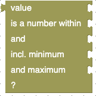
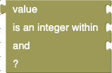

# blockly-ai-playground #

experiment with AI and build your own AI agents using Blockly - even if you are a complete beginner! (also suitable for school lessons)

> (Work in progress - intended as a contribution to the [Backdrop Build](https://backdropbuild.com/) contest, please stay tuned - contest ends at July, 31st)

[Live Demo](https://rozek.github.io/blockly-ai-playground/LiveDemo) **Warning: this is currently just a "proof-of-concept" which only runs an inference on a given OpenAI-compatible Server (tested with [Perplexity](https://www.perplexity.ai/)). More interesting blocks will follow in the next few days**

## Overview ##

AI agents are "cool" these days and can be found at many places - but for most of us, they are basically just "black boxes" which do not reveal how they work internally.

[Blockly](https://developers.google.com/blockly) is a visual programming environment developed by Google that allows users to create code using drag-and-drop "Lego"-like blocks. It is designed to simplify coding by abstracting away the syntax, making it accessible for beginners and educational purposes.

By combining these two technologies, the "blockly-ai-playground" offers beginners and casual programmers an easy way to play and experiment with AI and build their own AI agents!

## Prerequisites ##

"blockly-ai-playground" can be used with any AI provider offering an [OpenAI compatible API](https://platform.openai.com/docs/api-reference) - this may be [OpenAI](https://openai.com/) itself, [Perplexity](https://www.perplexity.ai/) (which was used for development), [Ollama](https://ollama.com/) (which runs LLMs locally on one's computer) and, presumably, many others.

As a consequence, you will need

* the **URL of an API entry point** (either locally on your machine or on the internet) and
* an **API Access Key** if you are using an official AI provider

While you may already use large language models (LLMs) on their own, they can only show their true capabilities in combination with other tools - this is what makes "agents" so powerful.

One of these tools is the web search. Since automating search engines is quite tedious, the "blockly-ai-playground" uses [SearXNG](https://docs.searxng.org/) for that purpose. Although there are several [public servers](https://searx.space/) which offer a web interface similar to other search engines, the [SearXNG API](https://docs.searxng.org/dev/search_api.html) is normally not publically available and you should run your own SearXNG instance instead (which does not have to be public but may remain private) - fortunately, installation is really simple if you use [Docker](https://www.docker.com/) (which is free for personal use, choose "Docker Desktop" rather than the CLI version - it is much simpler to maintain)

Thus, if you want to use the built-in web search, you should install

* [Docker Desktop](https://www.docker.com/products/docker-desktop/)
* [SearXNG](https://docs.searxng.org/admin/installation-docker.html)

## Custom Blocks ###

Besides common blocks which can be found in many Blockly environments, the "blockly-ai-playground" also provides a set of custom blocks to manage an internal context, a simple (but dynamic) user interface, basic and enhanced functions for AI, auxiliary tools for AI agents and other useful functions.

### Playground Context ###

(t.b.w.)

### Playground UI ###

(t.b.w.)

> sets the current value of a given option for an UI element with the given key to a given value. If no element with the given key can be found, an exception is thrown and the program aborted. Which options and option values are meaningful (and, thus, used by the UI), depends on the type of the given UI element

> returns the current value of a given option for an UI element with the given key. If no element with the given key can be found, an exception is thrown and the program aborted. The requested option does not have to exist

> returns `true` if an UI element with the given key is enabled or `false` otherwise. If no element with the given key can be found, an exception is thrown and the program aborted.

> enables the UI element with the given key. If no element with the given key can be found, an exception is thrown and the program aborted.

> disables the UI element with the given key. If no element with the given key can be found, an exception is thrown and the program aborted.

> returns `true` if an UI element with the given key (exists and) is enabled. If no element with the given key can be found, an exception is thrown and the program aborted.

### AI Basics ###

(t.b.w.)

### AI Mezzanines ###

(t.b.w.)

### AI Tools ###

(t.b.w.)

### Miscellany ###

The following blocks do not fit into the categories shown before - may may still be helpful when creating agents:

> waits for a given number of seconds and continues

> opens a browser "alert" pop-up dialog, displays the given message and continues as soon as the user has closed the dialog

> opens a browser "confirmation" pop-up dialog, displays the given message and continues as soon as the user has responded with "ok" or "Cancel". If cancelled, the block returns `false`, otherwise it returns `true`

> opens a browser "prompt" pop-up dialog, displays the given message and continues as soon as the user has entered a response. If cancelled, the block returns an empty string, otherwise it returns the entered string

> returns `true` if the given value contains a string that is neither empty nor contains whitespace only - or `false` otherwise

> returns `true` if the given value contains a number - or `false` otherwise

> returns `true` if the given value contains a number with a value ranging from the given minimum to the given maximum - or `false` otherwise. The additional arguments "withMinimum" and "withMaximum" specify wether the given "minimum" and "maximum" values are themselves part of that range or not

> returns `true` if the given value contains an integer number - or `false` otherwise

> returns `true` if the given value contains an integer number with a value ranging from the given minimum to the given maximum - or `false` otherwise

> returns `true` if the given value contains an "ordinal" number (i.e., an integer greater than or equal to 0) - or `false` otherwise

> returns `true` if the given value contains a "cardinal" number (i.e., an integer greater than or equal to 1) - or `false` otherwise

> returns `true` if the given value contains a string that matches a given JavaScript regular expression - or `false` otherwise

> returns `true` if the given value contains a string that looks like a URL - or `false` otherwise

> returns `true` if the given value contains a string that looks like a Wikipedia document URL - or `false` otherwise

## Examples ##

(t.b.w.)

## License ##

[MIT License](LICENSE.md)
